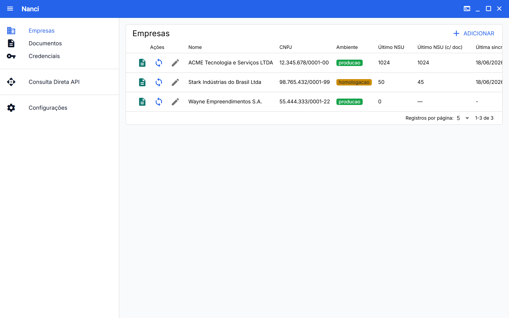
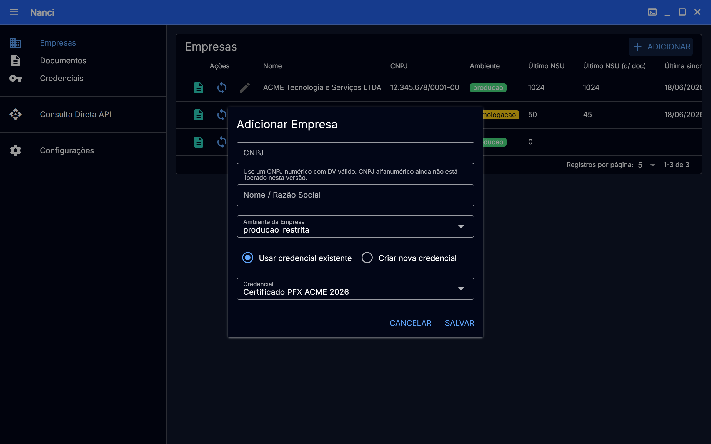
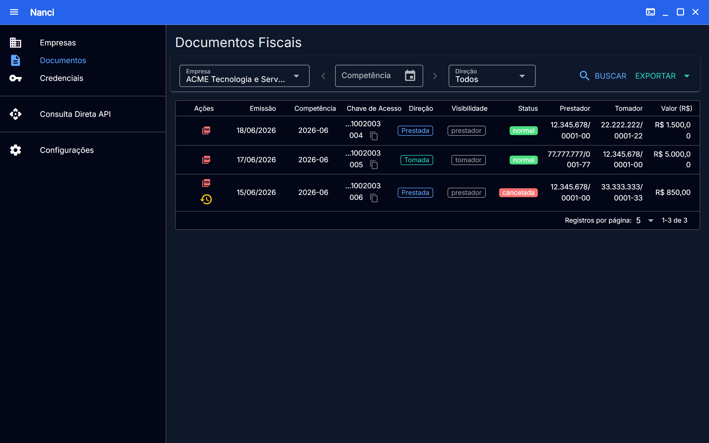
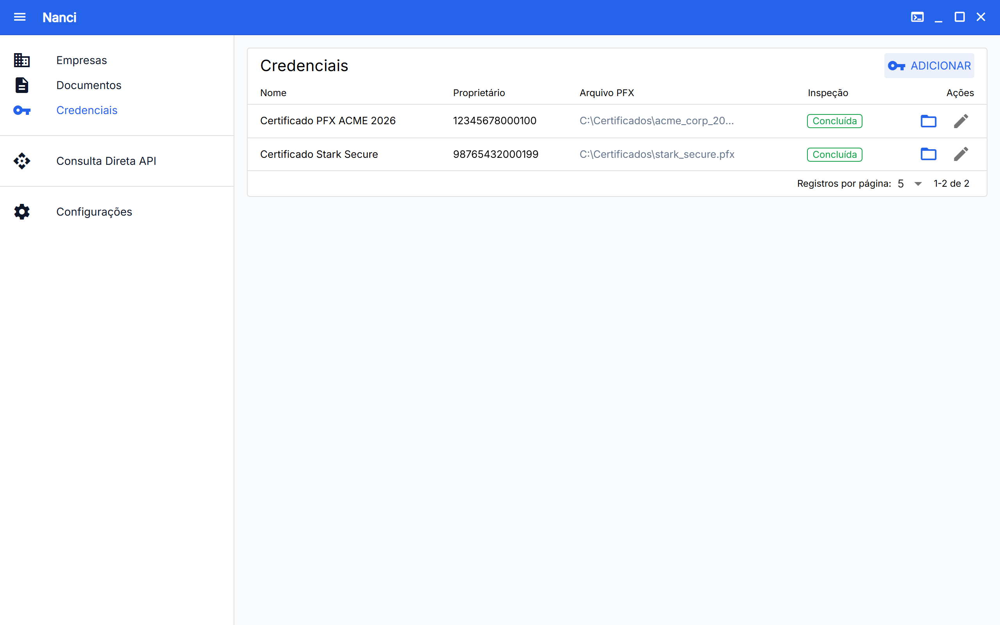
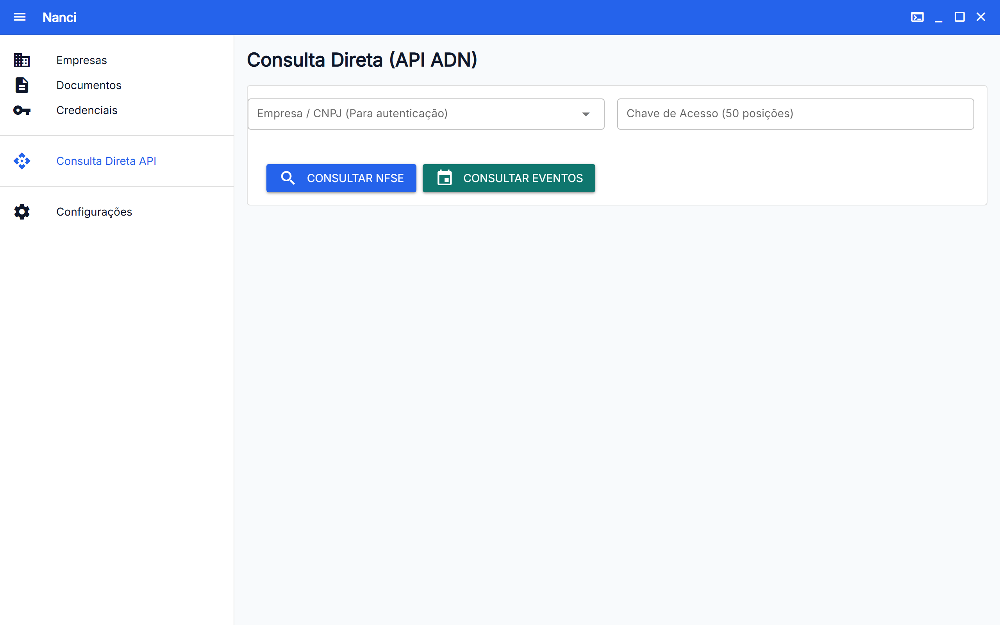

# Nanci

**Nanci** é uma ferramenta desktop e CLI para sincronizar, baixar e exportar Notas Fiscais de Serviço Eletrônicas da **NFS-e Nacional**.

Ela permite cadastrar empresas, sincronizar notas via certificado A1, manter o progresso localmente e exportar os dados para conferência, contabilidade ou backup.

Baixe o instalador mais recente na página de **Releases** do GitHub.

Para usar o aplicativo desktop, basta instalar o aplicativo compilado **não é necessário instalar Go, Node.js, pnpm ou Wails**.

## Telas do Aplicativo

### 🏢 Empresas (Dashboard Principal)
Sincronização incremental por NSU e status da última sincronização das empresas cadastradas.

| Tema Claro | Tema Escuro |
| :---: | :---: |
|  |  |

*Fluxo intuitivo para cadastramento de novas empresas:*

<p align="center">
  
</p>

### 📄 Documentos Fiscais (NFS-e)
Visualização detalhada das notas com filtros por Empresa, Competência e Direção (Notas Tomadas, Prestadas ou Intermediadas).

| Tema Claro | Tema Escuro |
| :---: | :---: |
|  |  |

### 🔑 Credenciais (Certificados A1)
Gerenciamento centralizado de certificados `.pfx` ou `.p12` com validação de status de inspeção.

| Tema Claro | Tema Escuro |
| :---: | :---: |
|  |  |

### 🔍 Outros Recursos
* **Consulta Direta (API ADN)**: Busca pontual e depuração por chave de acesso ou eventos.
* **Console de Sincronização**: Logs de processamento em lote em tempo real exibidos diretamente no app.

| Consulta Direta (Tema Escuro) | Console de Logs (Tema Escuro) |
| :---: | :---: |
|  |  |

---


### Desenvolvimento

A aplicação desktop usa **Wails**, com backend em Go e frontend em Vue.

Requisitos:

* Go 1.23+
* Node.js 20+
* pnpm
* Wails CLI

Instale o Wails CLI:

```bash
go install github.com/wailsapp/wails/v2/cmd/wails@latest
```

Rode em modo de desenvolvimento:

```bash
cd internal/desktop
wails dev
```

Gere o instalador Windows:

```bash
cd internal/desktop
wails build -platform windows/amd64 -nsis -m
```

O instalador fica em:

```txt
internal/desktop/build/bin/
```

No Linux, a build Windows com `-nsis` exige ferramentas como `mingw-w64` e `nsis`.

---

## CLI

A versão CLI é útil para automações, scripts e uso em servidor.

### Build

```bash
git clone https://github.com/vasfvitor/nanci.git
cd nanci
go build -o nanci.exe ./cmd/nanci
```

### Uso básico

Adicionar empresa:

```bash
./nanci.exe company add \
  --cnpj 12345678000199 \
  --name "Minha Empresa" \
  --cert "C:\Caminho\para\certificado.pfx"
```

Para informar a senha do certificado sem digitar no prompt:

```bash
NANCI_CERT_PASSWORD=senha
```

Ou use um arquivo `.env.local` não versionado na raiz do projeto:

```dotenv
NANCI_CERT_PASSWORD=senha
```

Variáveis reais do ambiente continuam tendo prioridade sobre `.env.local`.

Sincronizar notas:

```bash
./nanci.exe pull --cnpj 12345678000199
```

Exportar:

```bash
./nanci.exe export xlsx --cnpj 12345678000199 --out "relatorio.xlsx"
./nanci.exe export csv  --cnpj 12345678000199 --out "relatorio.csv"
./nanci.exe export zip  --cnpj 12345678000199 --out "notas_fiscais.zip"
```

---

## Funcionalidades

* Sincronização incremental por NSU.
* Checkpoints locais em SQLite.
* Leitura de certificados A1 `.pfx` e `.p12`.
* Autenticação mTLS.
* Exportação em `.xlsx`, `.csv` e `.zip`.
* Separação entre notas emitidas e tomadas.
* Extração de número da NFS-e, descrição do serviço, retenções e valor líquido.
* Preservação dos XMLs originais.

---

## Estrutura

```txt
cmd/nanci              CLI
internal/desktop       App desktop Wails
internal/cli           Comandos Cobra
internal/app           Casos de uso
internal/store         SQLite e migrações
internal/nfse          Domínio e parser XML
internal/report        Exportadores
```

---

## Desenvolvimento

Rode as verificações antes de commitar:

```bash
make check
```

Ou separadamente:

```bash
make fmt
make lint
make test
make security
```

---

## Contribuindo

Issues e PRs são bem-vindos.
