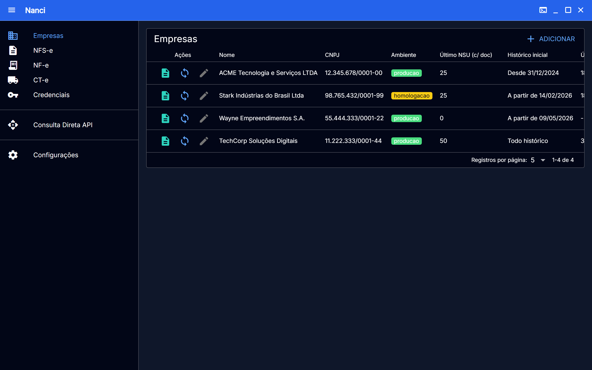
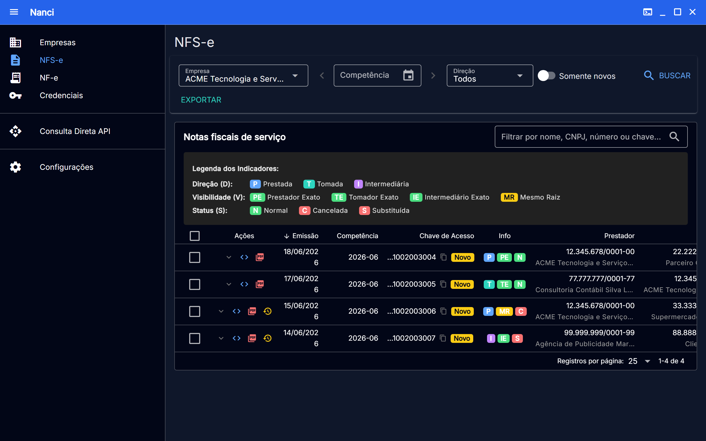
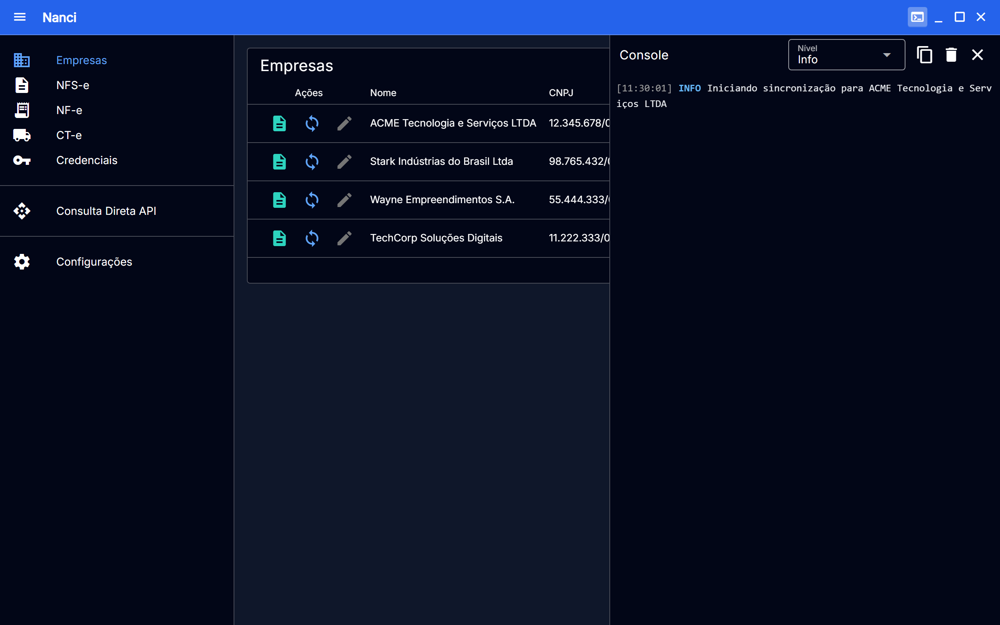
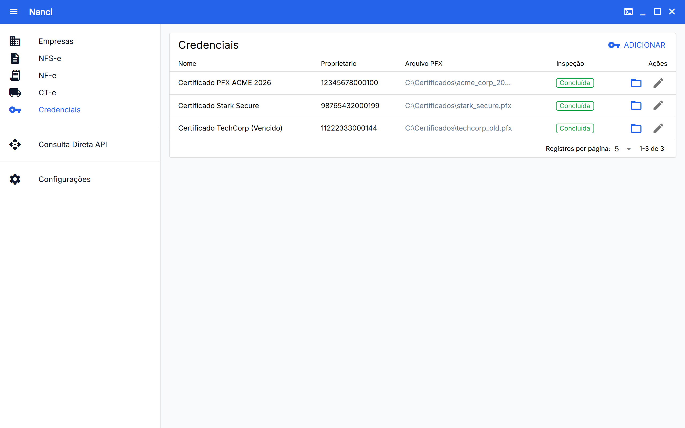
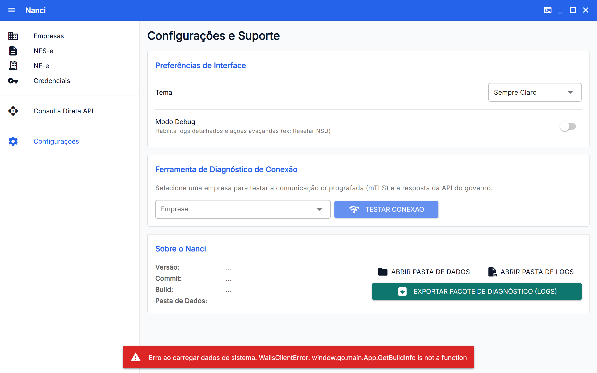

<p align="center">
  
</p>

# Nanci

App desktop e CLI para baixar NFS-e da NFS-e Nacional via API ADN com certificado A1. Dados salvos local em SQLite.

<p align="center">
  
</p>

Instale pelo [Releases](../../releases).

---

- Múltiplas empresas com credenciais separadas
- Sincronização incremental por NSU
- Notas prestadas, tomadas e intermediadas
- ISS, IRRF, INSS, PIS, COFINS e CSLL por nota
- Exportação em `.xlsx`, `.csv`, `.zip` ou `.pdf` (DANFSE)
- XMLs originais preservados
- Tema claro e escuro

<details>
<summary>Mais telas</summary>

| Documentos | Console |
| :---: | :---: |
|  |  |

| Credenciais | Configurações |
| :---: | :---: |
|  |  |

</details>

---

## CLI

```bash
git clone https://github.com/vasfvitor/nanci.git
cd nanci
go build -o nanci.exe ./cmd/nanci
```

```bash
# Adicionar empresa
./nanci.exe company add --cnpj 12345678000199 --name "Minha Empresa" --cert cert.pfx

# Sincronizar
./nanci.exe pull --cnpj 12345678000199

# Exportar
./nanci.exe export xlsx --cnpj 12345678000199 --out relatorio.xlsx
./nanci.exe export danfse --cnpj 12345678000199 --chave 35... --out nota.pdf
./nanci.exe export danfse-zip --cnpj 12345678000199 --out notas.zip
./nanci.exe export zip --cnpj 12345678000199 --out xmls.zip
```

A senha do certificado pode ser passada via `NANCI_CERT_PASSWORD` ou num `.env.local` na raiz.

---

## Desenvolvimento

Backend em Go + frontend Vue 3, montados com [Wails](https://wails.io/).

```bash
go install github.com/wailsapp/wails/v2/cmd/wails@latest
cd internal/desktop && wails dev
```

```bash
make check
```

```
cmd/nanci         CLI
internal/desktop  Wails (Go + Vue)
internal/app      Casos de uso
internal/store    SQLite
internal/nfse     Parser XML
internal/report   Exportadores
```

---

Issues e PRs são bem-vindos.
