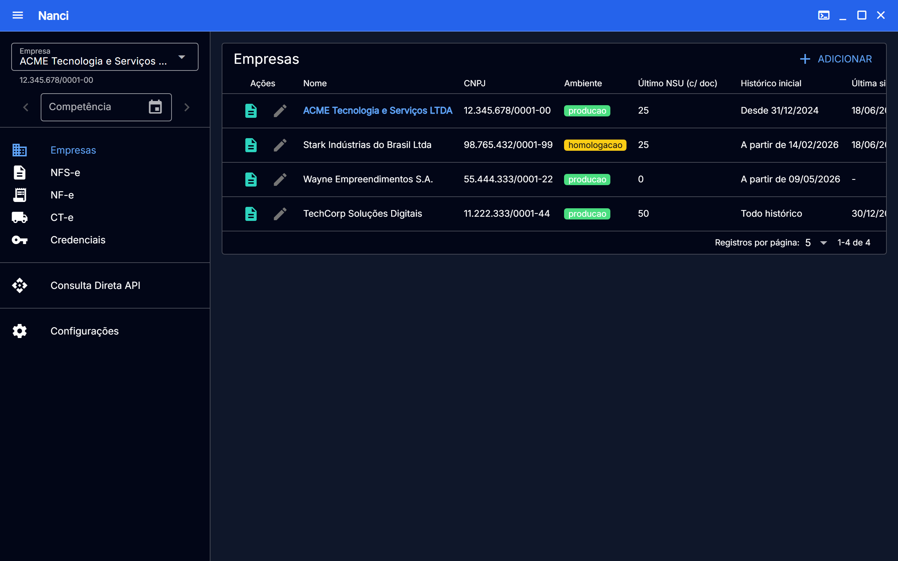

<p align="center">
  
</p>

<h1 align="center">Nanci</h1>

<p align="center">
  Baixe NFS-e, NF-e e CT-e direto do governo, com o certificado A1 da empresa.<br>
  Aplicativo desktop para Windows e linha de comando. Tudo fica no seu computador.
</p>

<p align="center">
  <a href="https://github.com/vasfvitor/nanci/releases/latest"></a>
  <a href="LICENSE"></a>
  <a href="https://vasfvitor.github.io/nanci/"></a>
</p>

<p align="center">
  
</p>

## O que faz

| Documento | Origem | O que o Nanci faz |
|---|---|---|
| **NFS-e** | Ambiente de Dados Nacional (ADN) | Baixa as notas tomadas, prestadas e intermediadas, com eventos. Exporta para Excel, CSV, ZIP de XMLs e DANFSe em PDF. |
| **NF-e** (modelo 55) | Distribuição DF-e da SEFAZ | Baixa as notas recebidas e registra a Manifestação do Destinatário: Ciência da Operação em lote e manifestações conclusivas, sempre com confirmação. Acompanha os prazos. |
| **CT-e** (modelos 57, 64 e 67) | Distribuição DF-e da SEFAZ | Baixa CT-e, CT-e OS, GTV-e e CT-e Simplificado em que a empresa é parte, com eventos, e acha o CT-e do frete de uma NF-e. |

- Várias empresas, cada uma com o seu certificado A1 (`.pfx`/`.p12`) e ambiente.
- Sincronização incremental por NSU, respeitando o limite de consultas da SEFAZ.
- Sem servidor intermediário: a conexão vai do seu computador direto ao ADN e à SEFAZ. XMLs e banco SQLite ficam no disco; a senha do certificado fica no cofre do sistema operacional.

**Não faz:** emissão de notas, acesso a portais municipais ou scraping, NFC-e, MDF-e e outros modelos, importação de XML avulso. A SEFAZ não distribui ao emitente as NF-e e CT-e que ele mesmo emitiu, e o ADN pode não trazer todas as NFS-e prestadas; [veja por quê](https://vasfvitor.github.io/nanci/docs/faq/).

## Instalação

1. Baixe `nanci-desktop-windows-amd64-<versão>-installer.exe` da [última versão](https://github.com/vasfvitor/nanci/releases/latest).
2. Execute. O instalador é por usuário e não pede administrador.
3. Em **Empresas → Adicionar**, informe o CNPJ, o certificado, a UF e escolha o ambiente `producao`.

O executável não tem assinatura de código; confira o SHA-256 com o `nanci-checksums.txt` da versão. Passo a passo em [Instalação e primeiro uso](https://vasfvitor.github.io/nanci/docs/instalacao/).

## Linha de comando

O instalador traz só o desktop. O CLI é compilado a partir do código (`go build -o nanci.exe ./cmd/nanci`) e usa o mesmo banco.

```bash
nanci company add --cnpj 12345678000199 --name "Minha Empresa" --cert empresa.pfx --env producao --uf SP

nanci pull --cnpj 12345678000199          # NFS-e
nanci nfe pull --cnpj 12345678000199      # NF-e
nanci cte pull --cnpj 12345678000199      # CT-e

nanci export xlsx --cnpj 12345678000199 --competencia 2026-09 --out setembro.xlsx
```

Comandos que enviam eventos à SEFAZ (`nfe ciencia`, `nfe manifestar`) ou apagam dados (`nfe reset`, `cte reset`) só simulam sem `--confirmar`. Referência completa em [Linha de comando](https://vasfvitor.github.io/nanci/docs/cli/).

## Documentação

- **Uso**: [vasfvitor.github.io/nanci](https://vasfvitor.github.io/nanci/): [NFS-e](https://vasfvitor.github.io/nanci/docs/nfse/), [NF-e](https://vasfvitor.github.io/nanci/docs/nfe/), [CT-e](https://vasfvitor.github.io/nanci/docs/cte/), [certificado](https://vasfvitor.github.io/nanci/docs/certificados/), [privacidade e backup](https://vasfvitor.github.io/nanci/docs/privacidade/), [FAQ](https://vasfvitor.github.io/nanci/docs/faq/), [solução de problemas](https://vasfvitor.github.io/nanci/docs/troubleshooting/).
- **Técnica**: [arquitetura](docs/ARCHITECTURE.md), [integração NFS-e/ADN](docs/NFSE_ADN.md), [NF-e/SEFAZ](docs/NFE_SEFAZ.md), [CT-e/SEFAZ](docs/CTE_SEFAZ.md), [certificados](docs/CERTIFICATES.md).
- **Desenvolvimento**: [DEVELOPMENT.md](docs/DEVELOPMENT.md) e [CONTRIBUTING.md](CONTRIBUTING.md).

## Problemas e contribuição

Antes de abrir uma issue, veja a [solução de problemas](https://vasfvitor.github.io/nanci/docs/troubleshooting/). **Nunca anexe certificado, senha, XMLs reais ou o banco de dados em issues públicas.** Vulnerabilidades vão por e-mail, conforme o [SECURITY.md](SECURITY.md).

## Licença

[GPL-3.0](LICENSE).
